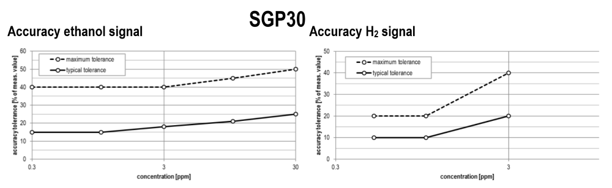

# Sensorik

[Mattermost Forum](https://mattermost.fbi.h-da.de/pse-mayer-ss19/channels/sensorik)  

Base UUID F000**XXXX**-0451-4000-B000-000000000000 es handelt sich um 128bit UUIDs fettgedruckte XXXX beschreiben die Variablen

| Type(hex) | Type(Text) | Beschreibung                                             | Format    | Umrechnung |
|:---------:|:----------:|:--------------------------------------------------------:|:---------:|:----------:|
|0xAA00     | Service    | Air Quality Service                                      |           |            |
|0xAA01     | TVOC Data  | Total Volatile Organic Compounds in ppb                  | uint16    |            |
|0xAA02     | eCO2 Data  | equivalent CO2 in ppm                                    | uint16    |            |
|   -       |            |                                                          |           |            |
|0xAA10     | Service    | Temperature Service                                      |           |            |
|0xAA11     | Temp       | Temperature in Grad Celsius                              | sint32    | / 1000.0   |
|   -       |            |                                                          |           |            |
|0xAA20     | Service    | Humidity Service                                         |           |            |
|0xAA21     | HUM        | Humidity in percent                                      | sint32    | / 1000.0   |
|   -       |            |                                                          |           |            |       
| 0xAA30    | Service    | Particulates Service                                     |           |            |
| 0xAA31    | Mass       | Mass concentration in μg/m^3 (PM1.0:PM2.5:PM4.0:PM10.0)* | uint32[4] | / 10^6     |
| 0xAA32    | Amount     | Amount per cm^3 (PM0.5:PM1.0:PM2.5:PM4.0:PM10.0)         | uint32[5] | / 10^6     |
| 0xAA33    | Tps        | Typical particle size                                    | uint32    | / 10^6     |

\* Partikelgröße in Mikrometern

PM1.0 < 1.0 µm (Micrometer); PM2.5  < 2.5 µm; PM4.0  < 4.0 µm; PM10.0 < 10.0 µm

PM0.5 < 0.5 µm; PM1.0  < 1.0 µm; PM2.5  < 2.5 µm; PM4.0  < 4.0 µm; PM10.0 < 10.0 µm

## Sensor accuracy

### SHT31

### SPS30

#### Mass concentration accuracy

#### Number concentration accuracy

No data provided by sensirion.

### SGP30
Accuracy at 25°C and 50% RH:

