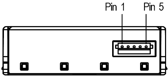

# Events

The [event structure](https://code.fbi.h-da.de/pse_mayer_ss19/trunk/tree/master/Allgemein/Beispiele/CY8Ckit-149-BLE/I2C_Event.cydsn) has peen merged into this project.  
Each sensor will have to create their own events as the measurements come in.

## Creating a new event for your sensor

In order to implement a new event, you need to make sure there is a corresponding event type and a corresponding event subtype. The event type specifies which measurements are in the event while the event subtype indicates which sensor the measurements came from. To do this, open `event.h` and check for / add definitions for `EVTYP_MEASUREMENT` & `EVSUBTYP_SENSOR`. You also need a `typedef` for a pointer to your event: `typedef sEvtMeasurement_t* psEvtMeasurement_t;`.  
Next, check for a `typedef` for your event. If one does not exist, create one like this:

```C++
typedef struct{
    // Event header
    sEvtHead_t sEvtHead;      // Event type (has a length of 4 bytes)
    // Event payload
    uint32_t measurement;     // Measurement
} sEvtMeasurement_t;
```

Then you need to declare two functions to actually create an event: `void* eventWriteMeasurement(const uint8 subtype, const uint32_t measurement);` & `void* eventWriteSensorMeasurement(const uint32_t measurement);`.

Now go into `event.c` and implement these two functions like this:
```C++
void* eventWriteMeasurement(const uint8 subtype, const uint32_t measurement) {
    // Make sure there is enough free storage space in the event buffer for this event
    if(getFreeStorageSize() < sizeof(sEvtMeasurement_t)){
        // To avoid overflowing and subsequently crashing, don't write the event
        PRINTF("Event buffer full.\r\n");
        return pDataPtr;
    }

    // Create the event
    psEvtMeasurement_t eventMeasurement = (psEvtMeasurement_t)pDataPtr;

    // Write the event header
    eventMeasurement->sEvtHead.evtType = EVTYP_MEASUREMENT;         // Event type
    eventMeasurement->sEvtHead.evtSubtype = subtype;                // Event subtype
    eventMeasurement->sEvtHead.evtLen = sizeof(sEvtMeasurement_t);  // Event length

    // Write the event data
    eventMeasurement->measurement = measurement;

    // Increment event pointer
    pDataPtr += eventMeasurement->sEvtHead.evtLen;

    // Write EOF event to mark the end of all written events.
    // Everything in the buffer beyond this is free to write to and does not contain any usable data.
    writeEOF();

    // Return the next free address for the next event
    return pDataPtr;
}

void* eventWriteSensorMeasurement(const uint32_t measurement) {
    return eventWriteMeasurement(EVSUBTYP_SENSOR, measurement);
}
```

Make sure you also include a way to display your new event on the terminal, in `void terminalInputChar(uint8 ch)`:
```C++
case EVTYP_MEASUREMENT: {
    psEvtMeasurement_t eventMeasurement = (psEvtMeasurement_t)pCurrDataBuf;
    PRINTF("Measurement: %d\r\n", eventMeasurement->measurement);
    break;
}
```

The last thing then is to actually create an event with your sensor, by adding `eventWriteSensorMeasurement(measurement);` to your sensors measuring method.  
If you did it correctly, you can start your measurements and then read them by displaying all events on the terminal.

# Sensors

## Availability of all possible configurations of sensors via I2C

| Symbol | Meaning       |
| -----  | ------------- |
|   -    | Not connected |
|   ✔    | Working       |
|  ❌    | Not working   |

### 4800 Ω pull-up

| SHT31 | SGP30 | SPS30 |
| ----- | ----- | ----- |
|   -   |   -   |   -   |
|   -   |   -   |   ✔   |
|   -   |   ✔   |   -   |
|   -   |   ✔   |   ✔   |
|   ✔   |   -   |   -   |
|   ✔   |   -   |   ✔   |
|   ✔   |   ✔   |   -   |
|   ✔   |   ✔   |   ✔   |

### No pull-up

| SHT31 | SGP30 | SPS30 |
| ----- | ----- | ----- |
|   -   |   -   |   -   |
|   -   |   -   |   ❌  |
|   -   |   ✔   |   -   |
|   -   |   ✔   |   ✔   |
|   ✔   |   -   |   -   |
|   ✔   |   -   |   ✔   |
|   ✔   |   ✔   |   -   |
|   ✔   |   ✔   |   ✔   |


## [SPS30](https://www.sensirion.com/en/environmental-sensors/particulate-matter-sensors-pm25/)

The SPS30 sensor by [Sensirion](https://www.sensirion.com/en/) measures [particulates](https://en.wikipedia.org/wiki/Particulates) in the air by laser scattering.

[The Driver used](https://github.com/Sensirion/embedded-sps) is made by [Sensirion](https://www.sensirion.com/en/).  

### Pin Assignment:
  

| Pin Nr | Type | Connect |
| ------ | ---- | ------- |
| 1      | VDD  | VDD     |
| 2      | SDA  | 6.5     |
| 3      | SCL  | 6.4     |
| 4      | SEL  | GND     |
| 5      | GND  | GND     |

### Usage

Initialise a struct `struct sps30_measurement measurement` before measuring.  
Start the sensor.  
Measure the result with `SPS30_Read_Data(&measurement, NULL)`.

When the SPS30 is the only sensor connected to the board, make sure there is a pull-up resistor connected to the I2C sda & scl lines.


## VOCSens

The [VOCSens board](https://www.glyn.de/Produkte/Sensoren/VOCSens) combines two sensors on one board, namely the [SHT31](https://www.sensirion.com/en/environmental-sensors/humidity-sensors/digital-humidity-sensors-for-various-applications/) & the [SGP30](https://www.sensirion.com/de/umweltsensoren/gassensoren/multipixel-gassensoren/), both are made by [Sensirion](https://www.sensirion.com/en/).


## [SHT31 Sensor](https://www.sensirion.com/en/environmental-sensors/humidity-sensors/digital-humidity-sensors-for-various-applications/)

[The Driver used](https://github.com/Sensirion/embedded-sht) is made by Sensirion.  

### Usage

Initialise the SHT31 Sensor.  
Initialise two floats, one for the temperature and one for the humidity.  
Then either initialise two pointers to those variables and pass those as arguments to the measuring function, or pass their addresses directly.  
You can either use a function which blocks during the measurement, or a non-blocking one. In this case you have to make sure to let enough time pass for the sensor to complete the measurement, which takes 15ms.  

The UART uses a baud rate of 115200.  
The ° from x°C might not render correctly in the terminal.  

Your terminal output should look something like this:  
```
Measured temperature: 24.152°C
Measured humidity:    50.531%
Measured temperature: 24.165°C
Measured humidity:    50.521%
Measured temperature: 24.136°C
Measured humidity:    50.543%
Measured temperature: 24.152°C
Measured humidity:    50.531%
...
```

### Combining with a different project

- Copy \*.c & \*.h into your project, but not main.c.  
- Copy both elements from TopDesign into your project.  
- Assign pins according to your needs (this project uses 3.0 for I2C scl, 3.1 for I2C sda; 7.0 for UART rx & 7.1 for UART tx)  
- In your main.c, include SHT31.h.  
- You need to initialise the sensor once using `GY_SHT31_Init()`  

To measure, use `GY_SHT31_Measure(double* temperature_, double* humidity_, bool console_out)` like this:  
```C++
double temperature;
double humidity;

GY_SHT31_Measure(&temperature, &humidity, true);
```

Note that function blocks during the duration of the measurement.  
You can also use `GY_SHT31_Ready_Measurement();` and `GY_SHT31_Read_Measurement(double* temperature_, double* humidity_, bool console_out);` as a non-blocking alternative:  
```C++
double temperature;
double humidity;

GY_SHT31_Ready_Measurement();
CyDelay(15);
GY_SHT31_Read_Measurement(&temperature, &humidity, true);
```


## [Adafruit SGP30](https://learn.adafruit.com/adafruit-sgp30-gas-tvoc-eco2-mox-sensor/)

### eCO2 (equivalent calculated carbon-dioxide)
concentration within a range of 400 to 60,000 parts per million (ppm)
https://ec.europa.eu/eurostat/statistics-explained/index.php/Glossary:Carbon_dioxide_equivalent

### TVOC (Total Volatile Organic Compound)
concentration within a range of 0 to 60,000 parts per billion (ppb)
https://www.umweltbundesamt.de/themen/gesundheit/umwelteinfluesse-auf-den-menschen/chemische-stoffe/fluechtige-organische-verbindungen#textpart-1
